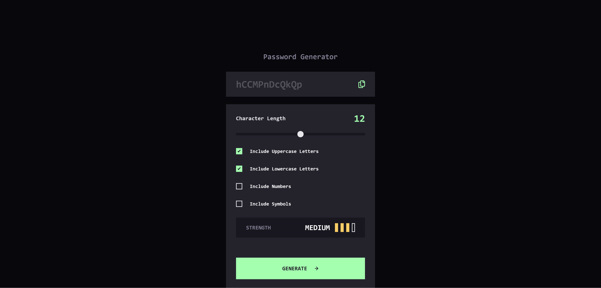
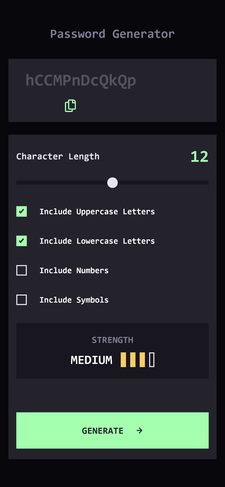

## Password Generator App — Frontend Mentor Challenge

A responsive, accessible password generator built with semantic HTML, modular SCSS, and vanilla JavaScript. This project focuses on secure password logic, custom input controls, and dynamic UI feedback — using a lightweight MVC architecture to mirror modern frontend frameworks like Angular.

[🔗 Live Demo](https://kellenkjames.github.io/password-generator-app/)

---

## Features

- Secure password generation with custom settings:
  - Uppercase, lowercase, numbers, symbols
  - Adjustable length via range slider
- Real-time password strength meter
- Clipboard copy functionality with feedback
- Interactive UI with hover, focus, and transition states
- Fully responsive layout using **flexbox** + **media queries**
- Modular JS files with **MVC-lite architecture**:
  - `model.js` → password logic + strength evaluation
  - `view.js` → DOM rendering + UI feedback
  - `controller.js` → app orchestration + event binding
- SCSS system with **design tokens, mixins, and component architecture**
- Accessible keyboard-friendly UX with semantic labels and ARIA support

---

## Tech Stack

- HTML5
- SCSS (Tokens, BEM, Mixins, Responsive Layout)
- JavaScript (ES6 Modules, MVC-lite architecture)
- Git / GitHub
- GitHub Pages (Deployment)
- Figma (Design Reference)

---

## Screenshots

| Desktop                                                     | Mobile                                                    |
| ----------------------------------------------------------- | --------------------------------------------------------- |
|  |  |

---

## Project Structure

<pre>
password-generator-app/
├── src/
│   ├── index.html
│   ├── style.css                 # Compiled CSS output
│   ├── style.scss                # Main SCSS entry
│   ├── /scss
│   │   ├── abstracts/            # _variables.scss, _mixins.scss
│   │   ├── base/                 # _reset.scss, _typography.scss
│   │   ├── layout/               # _grid.scss, _container.scss
│   │   ├── components/           # _slider.scss, _checkbox.scss, _output.scss
│   │   └── main.scss             # SCSS entry point
│   ├── /js
│   │   ├── model.js              # Password logic + strength evaluation
│   │   ├── view.js               # DOM selection + rendering
│   │   ├── controller.js         # Event handlers and flow control
│   │   └── main.js               # App entry point
│   ├── /assets
│   │   ├── images/               # Icons, assets
│   │   └── screenshots/          # Screenshots for README
├── .gitignore
└── README.md
</pre>

---

## Getting Started

1. Clone the repository:
   `git clone https://github.com/yourusername/password-generator-app.git`

2. Navigate to the project folder:
   `cd password-generator-app`

3. Compile SCSS to CSS (if using CLI):
   `sass scss/main.scss style.css`

4. Open `index.html` in your browser.

---

## ⏱️ Time Estimates

| Task                                   | Time Spent  |
| -------------------------------------- | ----------- |
| Initial Setup & File Scaffolding       | 1 hr        |
| HTML & Layout Structure (Mobile-First) | 2.5 hrs     |
| SCSS Architecture & Design Tokens      | 2 hrs       |
| MVC Logic & Password Generation        | 3 hrs       |
| Strength Meter, Copy Logic, QA         | 2.5 hrs     |
| Final Polish (Docs, Accessibility)     | 1 hr        |
| **Total**                              | **~12 hrs** |

---

## Key Learnings

- Implementing a **secure password generation algorithm** with dynamic input settings
- Building modular architecture with clear model-view separation in vanilla JS
- Creating custom form controls (range slider, checkboxes) with interactive states
- Using SCSS tokens and mixins for **design consistency and scalability**
- Improving UI polish with smooth transitions, clipboard feedback, and focus states
- Strengthening accessibility with ARIA, keyboard support, and semantic labels

---

## Improvements (If time allowed)

- Animate strength meter transitions
- Add visual feedback for copied state (e.g., tooltip or toast)
- Improve entropy-based strength evaluation
- Add dark/light mode toggle via CSS variables
